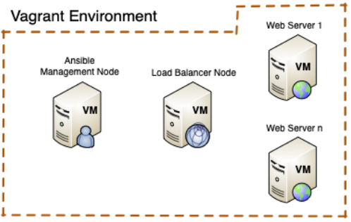

<a href="https://dei.tecnico.ulisboa.pt/"></a>

# [AGISIT 24/25](https://fenix.tecnico.ulisboa.pt/disciplinas/AGI11/2024-2025/1-semestre)

# Lab 2 - Infrastructure as Code (IaC)

# Overview

The objective of the experiments in this lab is to introduce a simple IT Automation Engine that is used to automate many IT operations, such as Cloud Provisioning, Configuration Management, Application Deployment, Intra-service Orchestration, etc. The IT Automation Engine to use is named **Ansible** and it models an IT Infrastructure by describing how all systems interrelate.


**Ansible** is “agentless”, meaning that it uses no agents in the infrastructure nodes, making it easy to deploy – and most importantly, it uses a very simple language called **YAML** (Yet Another Markup Language), in the form of **Ansible** Playbooks. These are special text files in plain English describing the automation jobs.


**Ansible** works by establishing connections to the Infrastructure Nodes and pushing out small programs, called **Ansible** Modules, to them. These programs are written to be resource models of the **desired state** of the system. **Ansible** executes those modules (over SSH by default), and automatically removes them when finished.


**Ansible** is typically installed on a “management machine”, such as the one you will be using in this Lab experiment.


**Vagrant** will also be used to create the virtual environment (see the following Figure), including one virtual machine with **Ansible** on it to act as the Management Node. Several additional **Vagrant** virtual machines will be created, as Infrastructure nodes to be managed by **Ansible**.




# Working Methodology

The working Methodology from this lab onward will be as **Teamwork** for each team, based on Coordination and/or division of Tasks among members of each team.

## Role Division

It is highly recommended to establish an Agreement among team members to split “Roles” in the execution of the Lab scripts and essentially on the Capstone Project. For example:

* **Infrastructure Resources**: one member of the team is responsible for deploying the “network related” things, which may include a Load Balancer, firewall rules, and addresses and ports in configuration files, etc;
* **Compute Resources**: another member of the team is responsible for deploying the servers, i.e., configuring all scripts and configuration files for the servers that will be created;
* **Application Configuration**: another member of the team is responsible for Configuring the servers of the Infrastructure in terms of the applications that will be run in them, including the configurations of those applications.

## Prepare the local Git repository for Project


If not yet done, each member of the team opens a Terminal in their own computer, changes to the "Projects" directory previously created (as advised in Lab 1), and in there executes the following:

* **First Task**: Configure GIT (example: adapt the user name and email, and the editor name):
```shell
$ cd Projects  
# Config GIT with your IST ID  
$ git config --global user.name "ist1234567" 
# Your email address of IST
$ git config --global user.email ist.user@tecnico.ulisboa.pt 
# 'editorname' is your preferred code editor: 
# can be Atom, code (VSCode), etc.  
$ git config --global core.editor "editorname --wait"
# specify how to treat end of lines  
# on Windows they are \r\n (carriage return - line feed)
$ git config --global core.autocrlf true  
# on macOs and linux it is just \n (line feed) 
$ git config --global core.autocrlf input
```
    
* **Second Task**: Each member of a team needs to create a local Repository, cloned from the already existing team Repository in the [GIT platform](https://gitlab.rnl.tecnico.ulisboa.pt). The repository of each team is identified with the format **agisit24-gN**, in which **N** is the number of the team in Fenix. Then, on the Projects directory execute the command as follows (with the URL adapted for your group):

```shell
$ git clone https://gitlab.rnl.tecnico.ulisboa.pt/agisit/agisit24-gN
```

* **Third Task**: After cloning, initialize the repository:

```shell
$ git init
# the dot (.) means all files and folders in that cloned repository
$ git add .  
# Now commit the 'changes'  
$ git commit -m "initial commit of cloned repo by yourname"
```

* **Fourth Task**: Try to push a small change to the team repository, by editing the **README.md** file:

```shell
# put a line on the README.md with your name, and then save and:
$ git add README.md
# Now commit the 'changes'
$ git commit -m "Add my name (yourname) to README"
$ git push origin
```
# Lab Work
## Part 1: Setting up the Vagrant-Ansible Environment

In this repository you will find a directory structure similar to the following (simplified):

```
└── webfront
    ├── Vagrantfile.docker
    ├── Vagrantfile.vbox		
    ├── bootstrap.sh
    ├── hosts_ssh.sh
    ├── hosts_ip.sh
    └── tools
        ├── ansible.cfg
        ├── files
        │   ├── ntp.conf
        │   └── ntp.conf.j2
        ├── frontend_templates
        │   ├── default-site.j2
        │   ├── haproxy.cfg.j2
        │   ├── index.html.j2
        │   └── nginx.conf.j2
        ├── inventory.ini
        ├── ntp-install.yml
        ├── ntp-remove.yml
        ├── ntp-template.yml
        ├── site_docker.yml
        ├── site_vbox.yml
        └── ssh-addkey.yml
```

To start these Lab experiments, go to the directory **webfront** where you already have two **Vagrantfile** files:

* One (**Vagrantfile.vbox**) that can be used in systems with architectures **x86-64/amd64** and Hypervisor **Virtualbox as Provider**;
* In the other (**Vagrantfile.docker**), **Vagrant will use Docker as Provider**, requiring **Docker Desktop** installed. This Vagrantfile can be used in systems with architectures **x86-64/amd64**, but was designed specifically for systems with architecture **arm64**, namely Apple Silicon M1/M2 computers, because the Docker image supports both architectures.

Students with Apple Silicon M1/M2 computers **MUST** previously install **Docker Desktop** in their system, using, for example the Homebrew package manager:

```shell
$ brew install --cask docker
```

This experiment will make use of a Management Node named **mgmt**, a Load Balancer Node named balancer and several Web Server Nodes named **web1, web2, etc**.


# Part 2: Multi-Node spin off with Vagrant

The following steps are recommended, in order to successfully launch a working environment:

## First Step

As the solution can be created in different system architectures, you should either rename the appropriate **Vagrantfile** for the architecture of your system (by removing the extension), or **set an environment variable** to **specify the filename** to be used by Vagrant, for example:

```shell
~/labs/lab2/webfront$ export VAGRANT_VAGRANTFILE="Vagrantfile.docker"
```

You need now to **Validate** your **Vagrantfile** before proceeding, with the command:

```shell
~/labs/lab2/webfront$ vagrant validate
```

Before launching the Vagrant environment, run *vagrant status* to confirm that there are at least 4 virtual machines defined, i.e., a Management node, a Load Balancer, and two Web servers (example):

```shell
~/labs/lab2/webfront$ vagrant status
Current machine states:


mgmt        not created (docker)
balancer    not created (docker)
web1        not created (docker)
web2        not created (docker)


This environment represents multiple VMs. The VMs are all listed
above with their current state. For more information about a specific
VM, run `vagrant status NAME`.
```

In case there are machines in a state different from the not created, you need to verify the coherence of all the “infrastructure” files to be used by **Ansible**.

## Second Step

With an IDE (such as VSCode) or your preferred Code Editor, you should carefully study all the files that define the IT Infrastructure for this experiment, to become at ease with the instructions that allow you to automate the process.

The recommended process is the following:

* Interpret the **Vagrantfile** that will be used, explaining, in your own words, what you think the “instructions” in it are supposed to do.
* Analyze briefly the **bootstrap.sh** the **host_ip.sh** and the **host_ssh.sh** to interpret their purpose.

## Third Step

You can now launch the infrastructure with **vagrant up**. This will launch ALL the machines specified in the **Vagrantfile** into the Vagrant environment. You may however launch each machine individually by declaring its "name", e.g., **vagrant up name-of-machine**, for example, **vagrant up mgmt**.

As soon as the machines are running, you can login to the Management Node with **vagrant ssh mgmt**.

You can observe that the **Vagrantfile** has assigned predetermined IP addresses to each server, and then the post-install scripts added entries to the **/etc/hosts** file of the **mgmt** server, allowing you to have name resolution (i.e., server "name" to IP address) that will be crucial for the **hosts inventory** of **Ansible**.

So, do not forget to verify connectivity from the **mgmt** server, by pinging the other machines. For example, ping the Load Balancer node and then the other server nodes:


```shell
$ ping balancer
```

The response should be something like this:
```
PING balancer (192.168.56.11) 56(84) bytes of data.
64 bytes from balancer (192.168.56.11): icmp_seq=1 ttl=64 time=0.887 ms
64 bytes from balancer (192.168.56.11): icmp_seq=2 ttl=64 time=0.309 ms
^C
--- balancer ping statistics ---
3 packets transmitted, 3 received, 0% packet loss, time 2045ms
rtt min/avg/max/mdev = 0.309/0.506/0.887/0.269 ms
```

## Fourth step

Now check out how **Ansible** is installed on the **mgmt** server, and have a look at some of the configuration files that you will need to know about. For our first interactions with **Ansible**, we are going to use ad-hoc **Ansible** commands, and then we will look at automating some operations with **Ansible** Playbooks.

Check the version and configuration of **Ansible** with the following command:

```shell
$ ansible --version
```

Take a note of the results, as they will be necessary later.


Two important files for each infrastructure are the **ansible.cfg** file, and the hosts **inventory.ini** file (inside the `/tools` folder). The **ansible.cfg** can be global (default) in case **Ansible** does not find its configuration in the directory from where it was called, but should be called from the directory where the **Ansible** Playbooks are available for that specific Project. The **ansible.cfg** located in this directory typically contains **specific configurations for each specific Project**.

The contents of the inventory MUST reflect the systems that are to be deployed (as described in your Vagrantfile).

The **inventory.ini** lists the “machines” to be managed by **Ansible**. Observe that you have a **[lb]** group for the Load Balancer server, and a **[web]** group made up of web1, web2, etc. for the active web nodes. The **[web]** group also has additional web servers commented out, as those may be added later.

Please note that in the in the **inventory.ini** file, the lines starting with **#** mean that the instances they refer are not to be deployed (this can be changed to reflect what will be launched and configured).

## Fifth Step

Following the principles observed, edit the **Vagrantfile** in order to change the number of web servers to **more than 2 machines**. The final configuration of the system should consist of: a **mgmt** system, a **balancer** system, up to X web servers (**web1, web2,. . . webX**).

Do not forget to check the correct configuration of **IP addresses** and **Ports** for each web server machine.

**NOTE**: There are several configuration files that you need to modify, in order to have a fully functional and addressable system.

# Part 3: Ensuring SSH Connectivity Between Node

Now that you have successfully launched the system with the additional web servers, and that the **all those servers are reachable from the mgmt system** (are they?), you are in condition to proceed.

When using an Automation Engine such as **Ansible**, the connectivity to remote machines from the Management Node is done via ssh (Secure Shell). One issue that we need to deal with is that, if the Management Node has not yet connected to a machine via SSH, you will be prompted to verify the ssh authenticity of the remote node.

So, in order to continue, try to connect from the **mgmt** node to the **web1** node, using SSH. You should answer: no when receiving the response, which will be similar to the following:

```shell
$ ssh web1
```

The response should be something like this:
```
The authenticity of host 'web1 (192.168.56.31)' cannot be established.
ECDSA key fingerprint is SHA256:+DtWEX3D5bDNi+tt0VlSuu3kbsKsP66NhXrPSQrq82s.
Are you sure you want to continue connecting (yes/no/[fingerprint])? no
Host key verification failed.
```


<u>***ATTENTION: the following steps must be executed carefully. Read through before typing commands and make sure you do not step ahead in the answers, as some steps are not easily reversible!***</u>

As you could see when trying to ssh to **web1**, you were prompted to verify the authenticity of that server. You would find the exact same behavior when trying to open SSH to the other servers in your infrastructure. If nothing is done, this error condition will cause **Ansible** to prompt you whenever it tries to reach a host. For example, let’s run the **Ansible** ping module, which is not exactly like a traditional ICMP ping, but rather the equivalent of a Hello World program for **Ansible** to verify that it can login to the remote machines. The command to use this for **web1** server is **ansible web1 -m ping**.

```shell
~/tools$ ansible web1 -m ping
```
Response:
```
web1 | UNREACHABLE! => {
  "changed": false,
  "msg": "Failed to connect to the host via ssh: Warning: Permanently added 'web1,192.168.56.31' (ECDSA) to the list of known hosts.\r\nvagrant@web1: Permission denied (publickey,password).",*
  "unreachable": true
}
```

What you have seen from the response to the command was that **Ansible** could not connect due to authentication to the **web1** host. Given the error message saying that **Ansible** cannot connect to that host, what would happen if your infrastructure would be composed by 25, 50, 100 or 1,000 machines? Would you be willing to constantly be prompted? **Probably not!**

There are several ways of dealing with this issue:

1. Populate the **~/.ssh/known_hosts** file in the **mgmt** server: Use **ssh-keyscan** command to populate the file at the Management Node, with keys of the machines from the environment; → this option still needs password authentication.

2. Establish SSH Trust. → secure and appropriate for automated processes.

3. Turn off the authentication: via a configuration in the ssh config file; → insecure and dangerous!

It is obvious that **option 3 is not an option!**

## First option: Knowing the Hosts

This option may be satisfactory for an infrastructure with just a few systems, or for a development environment. This is typically what happens when you launch a local environment with Vagrant for testing or development. Let’s run **ssh-keyscan** against **web1**:

```shell
~/tools$ ssh-keyscan web1
```
Response:
```
# web1:22 SSH-2.0-OpenSSH_8.2p1 Ubuntu-4ubuntu0.3
web1 ecdsa-sha2-nistp256 AAAAE2V.....gTQr+ybc=
web1 ssh-rsa AAAAB3NzaC1........UtsOSWM=
```

As you can see, **web1**, returns two ssh public keys, that can be used to populate the known_hosts file of the Management Node. Now that the hosts are “known” at the Management Node, we will use the Ansible ping module via ssh to connect remotely as the **vagrant** user, and so we want Ansible to prompt to enter the password. The password is just **vagrant**:

```shell
~/tools$ ansible web1 -m ping --ask-pass
```
Response:
```
SSH password: 
web1 | SUCCESS => {
 "ansible_facts": {
 "discovered_interpreter_python": "/usr/bin/python3"
 },
 "changed": false,
 "ping": "pong"
}
```


You can see that a successful **ping pong** message from the remote machine is received, and that there was no error related with authenticity and Host key verification. This confirms that a whole chain of things is working correctly, i.e., the remote machine is up, **Ansible** is working, the hosts inventory is configured correctly, **ssh** is working with the **vagrant** user account, and that **Ansible** can remotely execute commands.

## Second Option: Establishing a SSH Trust with Ansible

To establish a **“passwordless”** but secure access to the infrastructure nodes, independently of their number – for a **“continuous integration system”** – in order to deploy automated application updates on a frequent basis, we need to opt for establishing a SSH trust, between the Management Node and the other nodes of the infrastructure.

We will do that by **using Ansible itself** via a Playbook. It is now time to learn a bit about how **Ansible** works.

In order to proceed, please delete the **.ssh/known_hosts** file in the **mgmt** server that was created in the previous section.

Let’s look at the files in the **tools** directory of the Management Node:

```shell
~/tools$ ls
```
Response:
```
ansible.cfg frontend_templates ntp-install.yml ntp-template.yml ssh-addkey.yml
files inventory.ini ntp-remove.yml site.yml
```

You may notice a file named **ssh-addkey.yml**, which is an _Ansible Playbook_. Playbooks are Ansible’s configuration, deployment, and orchestration language. The file is formatted in **YAML** (YAML Ain't Markup Language, a recursive acronym), human-readable and very easy to understand. You can learn about Playbooks in more detail at the [Ansible documentation site](https://docs.ansible.com/ansible/latest/playbook_guide/playbooks_intro.html).

A Playbook is composed of one or more “**plays**” in a list. Looking at the **ssh-addkey.yml** you can see that we have only the **hosts** play, and the task to deploy an authorized ssh key onto a remote machine, which will allow **Ansible** to connect without using a password.

***NOTE: look carefully at the indentation of the Playbook lines, as it is crucial for the correct interpretation of the content of the YAML file.***

* **hosts**: This “play” defines which hosts in the **hosts inventory** we want to target. For this “play” the hosts will be **“all”**
    * **remote user**: The name of the user.
    * **become**: We want to run these commands as super user.
    * **become method**: The method is sudo.
    * **gather facts**: By default, “facts” are gathered when a Playbook is run against remote hosts. These facts include things such as hostname, network addresses, etc. These facts can be used to alter the Playbook execution behavior, or to be included in configuration files. We are not going to use them just yet, so “facts” are turned off.

* **tasks**: This section of the hosts play, is where we define the tasks we want to run against the remote machines.
    * **name**: Each task has a name associated with it, and it is just an arbitrary meaningful title.
        * **authorized key**: This is the Ansible module to be used in the task.
        * **user**: The remote authorized vagrant user.
        * **key**: The module is instructed to add an authorized key, and where on the Management Node the key file is to be looked up.
        * **state**: the module is instructed to make sure that the key exists on the remote machine.


It is a good practice to verify whether the syntax of the playbook is correct. For that purpose, run the following command against each of the playbooks, for example, if the syntax in the case of the **ssh-addkey.yml** playbook were not be correct some warning or error would result, but if the syntax is correct, only the name of the playbook is returned:
```
~/tools$ ansible-playbook ssh-addkey.yml --syntax-check

playbook: ssh-addkey.yml
```


Continuing with the method for establishing SSH trust, you can verify that on the Management Node, in the **.ssh** directory (of the home user) there is no public RSA key. Let’s then create one key by running **ssh-keygen -t**, and specify the type of key we want to create, which will be RSA, and then tell how long a key we want with parameter -b. After that, verify that the keys have been created, by listing the contents of **.ssh**.

Please hit **ENTER** to the prompts, and do **not enter a password**.

```
~/tools$ ssh-keygen -t rsa -b 2048
Generating public/private rsa key pair.
Enter file in which to save the key (/home/vagrant/.ssh/id_rsa): 
Enter passphrase (empty for no passphrase): 
Enter same passphrase again: 
Your identification has been saved in /home/vagrant/.ssh/id_rsa
Your public key has been saved in /home/vagrant/.ssh/id_rsa.pub
The key fingerprint is:
SHA256:u9iXXb0ewuCU7u0/5XEfppgX+up9q5/8ZBmXgSMHD3E vagrant@mgmt
The key's randomart image is:
+---[RSA 2048]----+
|           +.E   |
|            = .  |
|           . = . |
|            + . o|
|        S  +   +.|
|         .+ o..+B|
|        .  =++++X|
|       o .+++oo*=|
|      . o..+=**B=|
+----[SHA256]-----+
```

You can now verify that in the **.ssh** directory (of the home user), there is a KEYPAIR of a public and private RSA key.

Now that we have fulfilled the requirements of generating a local RSA key pair for the **vagrant** user, let´s deploy it to our remote client machines. We do this by running the command **ansible-playbook**, and then the Playbook name, in this case **ssh-addkey.yml**.

We also need to add the **--ask-pass** option, since we do not have “password less” login configured yet in those remote machines. The password to use is **vagrant**.


```
~/tools$ ansible-playbook ssh-addkey.yml --ask-pass
SSH password: 
PLAY [all] *****************************************************************************************************


TASK [install ssh key] *****************************************************************************************
changed: [balancer]
changed: [web2]
changed: [web1]


PLAY RECAP *****************************************************************************************************
balancer : ok=1  changed=1  unreachable=0 failed=0 skipped=0 rescued=0 ignored=0 
web1 : ok=1  changed=1  unreachable=0 failed=0 skipped=0 rescued=0 ignored=0 
web2 : ok=1  changed=1  unreachable=0 failed=0 skipped=0 rescued=0 ignored=0
```


The Playbook response says that it changed the nodes, **web1, web2 ...webX**, and **balancer**, to deploy the authorized key from the Management Node. In the end, we are given a Playbook “recap” section that provides with the okay, changed, unreachable, and failed tallies per node.

Rerun the **ansible-playbook** command for **ssh-addkey.yml** but not using the **--ask-pass** option, as we are not going to need that anymore. Notice that in our previous playbook run things changed, but in the most recent run, the tasks may all be green, and the playbook recap is green too, meaning that nothing was changed.

This is a good example of **idempotence**, meaning that **Ansible** scripts can be run many times in a row, and nothing will change, unless a change needs to be made. So, in this example, **Ansible** was smart enough to check the clients authorized key file, and see that it already exists, so it does not do anything.

***ON YOUR OWN, NOW:*** run ad-hoc **Ansible** commands, targeting all nodes:

1. Start with the **ping module** to verify that everything works as expected and without a password
2. Check the uptime of your hosts with **ansible all -m shell -a "uptime"**
3. Check what kernel versions are running on the hosts with **ansible all -m shell -a "uname -a"**


# Part 4: ON YOUR OWN: Setting Up a Load Balanced Web Service

The end result of this Lab experiment will be a Vagrant environment with a fully functional Load Balancer (implemented with [haproxy](http://www.haproxy.org)), with 3 (or up to six) web servers sitting behind it (implemented with [nginx](https://www.nginx.com),).

You will use **Ansible** to install all of the required packages, deploy configuration files, and start the correct services to each of these servers, all without logging in manually into any of those servers.

It is now time to proceed with the Configuration of the servers.

### Deploying Time Synchronization

The synchronization of Time on servers and networks is often vitally important. Without synchronization, the time on individual servers will slowly drift away from each other at varying degrees until each has a significantly difference in time. In systems that rely on ordered events occurring at specific times or logging of events, this can be a real problem. For example, transactions generated by a server with a system time slower than another server may log a transaction as being received before the other server, even though it was generated after it. In order to prevent that type of problem, a mechanism is required to disseminate accurate time to servers and network devices.

The **Network Time Protocol** (NTP) provides that mechanism through complex algorithms that maintain a high degree of time synchronization of servers on a network. NTP clients in the servers obtain highly precise timing information from Time Servers in the Internet (or from a Time Server in a Datacenter) in order to calibrate their own internal system time.


**Experiment 1**: Setting up the NTP service with the **ntp-install.yml** Playbook.

* Study the Playbook, and referencing the [Ansible documentation](https://docs.ansible.com/ansible/latest/user_guide/playbooks_intro.html), try to figure out what it does.
* Play the **ntp-install.yml** Playbook with the **ansible-playbook** command.
* Run the command **ansible targets -m shell -a "ntpq -p"** in the Management Node to query the NTP service. Observe carefully the results to have an idea of their meaning. **Suggestion**: copy the results to a text file, because you will need to compare them with the results from next experiment.

**Experiment 2**: Uninstall the NTP Service, because you want to change the Reference Time Servers. For this experiment, you have the **ntp-remove.yml** Playbook.

* Play the **ntp-remove.yml** Playbook with the **ansible-playbook** command.
* Run the command **ansible targets -m shell -a "ntpq -p"** in the Management Node to query the NTP service. Observe the results

**Experiment 3**: Setting up the customized NTP Service to use a more appropriate Reference Time Server for Europe Zone in order to reduce the lag. For this experiment, you have the **ntp-template.yml** Playbook.

* Run the Playbook, and after having successfully deployed the NTP service, run the command **ansible targets -m shell -a "ntpq -p"** in the Management Node to query the NTP service. **Did the servers report the correct time, or is it there something apparently wrong?**
* **NOTE**: As a matter of fact, **there is something wrong!** The Developer of the code for the configuration of the NTP service left something incorrect there. **Your mission is to find the BUG and correct it!**
* Interpret the Outputs of the **ansible targets -m shell -a "ntpq -p"** command **before** and **after** correction of the error. Describe the BUG you found, and how you corrected it.


### Deploying Time Synchronization

Before deploying, you should start by analyzing the **site_(docker/vbox).yml** playbook. You can notice that it consists of three plays that will allow to target specific groups of nodes, from within the same Playbook:

1. The first play (**# common**) targets **nodes** declared in the **hosts inventory**. This is useful for laying down a common configuration across a fleet of machines;
2. The **# web** play targets **all the web** nodes, for installing the web server, tweaking configuration files, and starting services;
3. The **# lb** play addresses the **load balancer** node, and you can notice a peculiar method in the tasks that basically allows to iterate over a list of packages, and have them installed, without duplicating code blocks.


You will likely understand the majority of what each play is doing, as it is just installing the package(s), deploying configuration file(s) and service patterns, some using [Jinja2](https://palletsprojects.com/p/jinja/), a template engine for Python, making sure that things are effectively started.

To get acquainted with these templates and the way to use the **“variables”** known by **Ansible**, you can now observe the “Ansible Facts”. In **Ansible**, variables related to remote systems are called facts, while variables related to **Ansible** itself are called **magic variables**.

Facts that are related to remote systems include operating systems, IP addresses, attached file systems, etc.

Try the following to discover some of those facts from the Dictionary related to any of the servers just configured, for example the balancer:


```
~/tools$ ansible balancer -m setup
balancer | SUCCESS => {
 "ansible_facts": {
 "ansible_apparmor": {
 "status": "disabled"
 },
 ......
```

For our purpose, i.e., identifying correctly the adequate "**facts**" (i.e., the variables) that we need to have configured in the templates for automatic configuration, we need to know how to determine from the Dictionary the elements that will provide us with the IP address and the hostname of each host. For that purpose, let us "inspect" what **Ansible** returns.

Please note, in the following command, that we are specifying to **Ansible** to obtain, from all "**targets**" defined in the inventory, the data in some of the Dictionary Facts, which will correspond to the host address, i.e. the IP address of each host. Normally, we need to test different arguments (variables) to see which ones will provide us with the information we need. Compare the used variables with the Facts you obtained earlier with **ansible balancer -m setup**:

```
~/tools$  ansible -i inventory.ini -m debug -a "var=hostvars[inventory_hostname].ansible_host" targets
balancer | SUCCESS => {
 "hostvars[inventory_hostname].ansible_host": "192.168.56.11"
}
web1 | SUCCESS => {
 "hostvars[inventory_hostname].ansible_host": "192.168.56.31"
}
web2 | SUCCESS => {
 "hostvars[inventory_hostname].ansible_host": "192.168.56.32"
}
```

#### ***The Load Balancer (haproxy)***

The [HAProxy](http://www.haproxy.org/) (community Edition) is a Free, very fast, Reliable, High Performance TCP/HTTP Load Balancer solution, particularly suited for very high traffic web sites.

The HAProxy configuration file (**haproxy.cfg**) guides the behavior of the load balancer. In this case, you may observe that you have several files with the extension j2 in the **frontend_templates** folder. These files are **Jinja2** template files for configurations of the services to be installed, and one of them corresponds to the **haproxy.cfg**.

There are four essential sections in the **haproxy.cfg** configuration file. They are global, defaults, frontend, and backend. These four sections define how the server performs as a whole, which are the default settings, and how client requests are received and routed to the backend web servers.

You can also observe in the file that some parameters are placed inside double curly braces {{.....}}, which correspond to variables that will be “replaced” with specific values by **Ansible** when configuring each server.


#### ***The Web Servers (nginx)***

From their website [NGINX](https://www.nginx.com/resources/glossary/nginx/), "NGINX is open source software for web serving, reverse proxying, caching, load balancing, media streaming, and more. It started out as a web server designed for maximum performance and stability. In addition to its HTTP server capabilities, NGINX can also function as a proxy server for email (IMAP, POP3, and SMTP) and as reverse proxy and load balancer for HTTP, TCP, and UDP servers."

The choice for using NGINX for this Lab experiment was just to prove that is possible to mix in the same solution different applications with identical functionalities, such as the cases of HAProxy and NGINX, as both can also be configured as High Performance Load Balancers.

In our case, one is configured just as a Load Balancer and the other just as a Web Server.


#### ***Benchmarking Tool***

For the last experiments is this Lab, we need to use a Benchmark command-line tool, which is a load generator for testing websites and HTTP APIs, commonly known as [Apache Benchmark](https://httpd.apache.org/docs/2.4/programs/ab.html). 

You will use the tool, but **running from your own personal computers** (not inside the Vagrant environment).

For *NIX based systems (Linux, macOS), proceed as follows:

* **ApacheBench** is already included with the Apple macOS distribution and no configuration or installation is necessary.

* For **Linux Debian** distributions you should proceed as follows to install the tool:

```shell
$ sudo apt-get update
$ sudo apt-get -y install apache2-utils
```

The command line call for ApacheBench in both macOS or Linux is simply **ab** with parameters, for example:

```
$ ab -n 1000 -c 2 http://127.0.0.1:8080/
```

For Microsoft Windows based systems, use the Chocolatey package manager by opening a Terminal (with Administrative rights) and execute the following commands:

```
$ choco upgrade all -y
$ choco install superbenchmarker
```

The command line call of Superbenchmarker in Microsoft Windows is also simply sb with parameters, for example:

```
$ sb -n 1000 -c 2 -u http://127.0.0.1:8080/
```

#### Deployment Procedures

In order to deploy the Applications in the servers and configure them, it is necessary to execute different procedures, depending on whether you are using the Virtualbox hypervisor or Docker Engine. Read carefully the Steps in **Experiment 4** in order to execute the correct procedures for your case.

**Experiment 4**: Configuration management of the Web servers and the Load Balancer. The procedure to configure the system depends on the type of "virtualization" used to launch the servers, either through the Virtualbox hypervisor, or through Docker Engine. The reason stems from with a limitation in Docker containers on the manipulation of the **/etc/hosts** file that is crucial for Docker linking system in terms of **namespaces** and Name Resolution. In Docker, the **/etc/hosts** file should only be manipulated manually at the image level, rather than at the container level.

* For **Docker**: Proceed to **Step B**.
* For **Virtualbox**: Proceed to **Step A**.
* **Step A**: For Virtualbox only, you have the **site_vbox.yml** Playbook. Study the Playbook, and referencing the [Ansible documentation](https://docs.ansible.com/ansible/latest/user_guide/playbooks_intro.html), interpret what it does. Study also the configuration files in folder **frontend_templates** and try to figure out the meaning of some of the parameters, or the purpose of some of the actions therein. After that, you can proceed to Step C.
* **Step B**: For this experiment, you have the **site_docker.yml** Playbook. Study the Playbook, and referencing the [Ansible documentation](https://docs.ansible.com/ansible/latest/user_guide/playbooks_intro.html), interpret what it does. Study also the configuration files in folder **frontend_templates** and try to figure out the meaning of some of the parameters, or the purpose of some of the actions therein.
* **Step C**: Play the **site_(docker/vbox).yml** Playbook with the **ansible-playbook** command.
* **Step D**: When finished, and if all went okay, run the **site_(docker/vbox).yml** playbook again and interpret the output. **What happened? What did you find different (or not)?** This is a common practice when testing complex configurations in order to confirm that nothing was forgotten.


**Experiment 5**: Testing the web cluster. Recall that you have a desktop or laptop in which you are running Vagrant on – the host machine – and that the **Vagrantfile** created a virtual Vagrant environment that mapped **port 8080** from the host machine, into the Load Balancer on **port 80**. So, when you connect to **127.0.0.1** **port 8080** on the host machine, it will be redirected to the Web Front environment via the Load Balancer on port 80.

1. Open a web browser in your host, write the URL http://127.0.0.1:8080 and hit return. You should be connected (into the Web Front environment), through the Load Balancer, and one of the Web servers should have served your request.
2. Hit the refresh button on the web browser (forcing with the Shift key). **Did something change?** If so, repeat the refresh several times. Pay attention to the results you have observed each time you refreshed the page.
3. Open a second tab in your browser and navigate to http://127.0.0.1:8080/haproxy?stats. You should land on the Load Balancer statistics page. For reference, read “[Exploring the HAProxy Stats Page](https://www.haproxy.com/blog/exploring-the-haproxy-stats-page/)”. 
4. If you are in a Microsoft Windows host, open a Terminal and run the command **sb -n 1000 -c 2 -u http://127.0.0.1:8080/**. This command tells the Benchmarker tool to send 1,000 requests, with a concurrency of 2, for the specified URL. Try to interpret the results from the benchmark tool.
5. If you are in a macOS or Linux host, open a Terminal and run the command **ab -n 1000 -c 2 http://127.0.0.1:8080/**. This command tells the Benchmarker tool to send 1,000 requests, with a concurrency of 2, for the specified URL. Try to interpret the results from the benchmark tool.
6. Modify the Benchmarker command for the concurrency parameter (-c) to a value still sustainable (try with some values, noting that in some host systems that value can be as high as 20 or more). Try to interpret the results from the Benchmarker tool and also from the statistics page of the Load Balancer.

#### Finishing the experiments

When finished the experiment, **Stop the Virtual Machines** and verify the **global state** of all active Vagrant environments on the system, issuing the following commands:

```
~/webfront$ vagrant halt  
~/webfront$ vagrant global-status
```

**Confirm that the statuses of the VMs is “powered off”**. You can destroy these machines, as they will not be used for the next Labs.


# Lab 2 Reporting

<ins>The Report must be a PDF file submitted to Fenix, in project AGISIT-LAB2</ins>

The name of the file **must** be ***LAB2-team-XX.pdf***, in which ***XX*** is the number of the team in Fenix.

There is only one report for each group, produced collaboratively, and needs to be submitted by just one member of the group (any one).

***The deadline for this submission is September 27, 2024, by 11h59 pm.***

The report’s format is very simple:

* Number and name of each active member of the group (this is to double check the composition of the groups, since sometimes there are changes that are not reflected in Fenix);
* The list of 10 questions below, each followed by the respective answer, with a formatting that is not enforced but that must be easy to read (clearly separating question-answer pairs);
* The answers are to be written preferably in English, but can also be written in Portuguese, as long as it can be understood by all the members of the group;
* Together with this script, you will find a MS-Word template for this report (file ***LAB2-team-XX.docx***), which you can edit and use to fill in your answers. Then save it as PDF and submit it to Fenix.

## New Questions

**Q1:** In the current deployment scenario defined in the Vagrantfile (with `mgmt`, `balancer`, and `webX`), which machines have to have Ansible installed?

1. All of them.
2. Only `mgmt` and `balancer`.
3. Only `mgmt`.

**Q2:** What is the purpose of each file? Make correspondence.

1. `bootstrap.sh`.
2. `hosts_ip.sh`.
3. `hosts_ssh.sh`.

a) Populate the `/etc/hosts` file in the target machine.

b) Install software packages.

c) Set up password authentication.

**Q3:** According to the Vagrantfile, for which machines the `bootstrap.sh` provisioning script is executed when running `vagrant up`?

1. All of them.
2. Only `mgmt` and `balancer`.
3. Only `mgmt`.

**Q4:** Which files did you have to modify in order to launch more web servers? Multiple choices may be correct.

1. `bootstrap.sh`.
2. `Vagrantfile.[vbox/docker]`.
3. `inventory.ini`.
4. `ansible.cfg`.

**Q5:** Which of the statements below are true? Multiple choices may be correct.

1. The output of `ansible --version` differs when we run it from the `/home/vagrant/tools` directory compared to running it from any other directory.
2. The `ansible.cfg` configuration file can only be global across all projects on the machine.
3. You can provide different `ansible.cfg` files for different projects on the machine.

**Q6:** What is the purpose of the `inventory.ini` file?

1. To list the machines for Ansible to manage.
2. To instruct Ansible that machines were deployed with Vagrant.
3. To define the correspondence between IP addresses and domain names of the deployed machines.

**Q7:** What is the safest and the most scalable way to ensure SSH connectivity between the management node and the other machines managed by Ansible?

1. Gathering public SSH keys from each machine with `ssh-keyscan`.
2. Using Ansible to deploy a local public key of `mgmt` to the remote machines.
3. Turning off authentication.

**Q8:** What Ansible module is used in the `ssh-addkey.yml` playbook?

1. `authorized_key`.
2. `lookup`.
3. `install ssh key`.

**Q9:** Ansible follows the concept of *idempotency*. What does it mean?

1. An idempotent operation will not produce side effects if executed multiple times.
2. All Ansible operations are idempotent.
3. An idempotent operation will result in the same state whether it is executed once or multiple times.

**Q10:** What is the difference between *facts* and *magic variables* in Ansible?

1. Facts are always consistent, whereas magic variables are transient.
2. Magic variables relate to the system configuration of remote machines, whereas facts are strictly defined in configuration files.
3. Facts contain information about remote machines, whereas magic variables are related to Ansible itself.

**Q11:** How are Ansible facts used in this lab?

1. Values of the gathered facts are manually inserted in the corresponding frontend files after deployment.
2. Ansible inserts the values of the gathered facts into the Jinja2 (`.j2`) templates when running the `site_[vbox/docker].yml` playbook.
3. Ansible inserts the values of the gathered facts after running the `ansible -i inventory.ini -m debug -a "var=hostvars[inventory_hostname].ansible_host" targets` command.

**Q12:** What is the expected VM status after running `vagrant halt`?

1. "running".
2. "not created".
3. "powered off".
