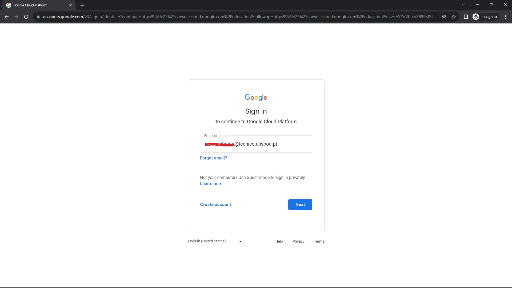
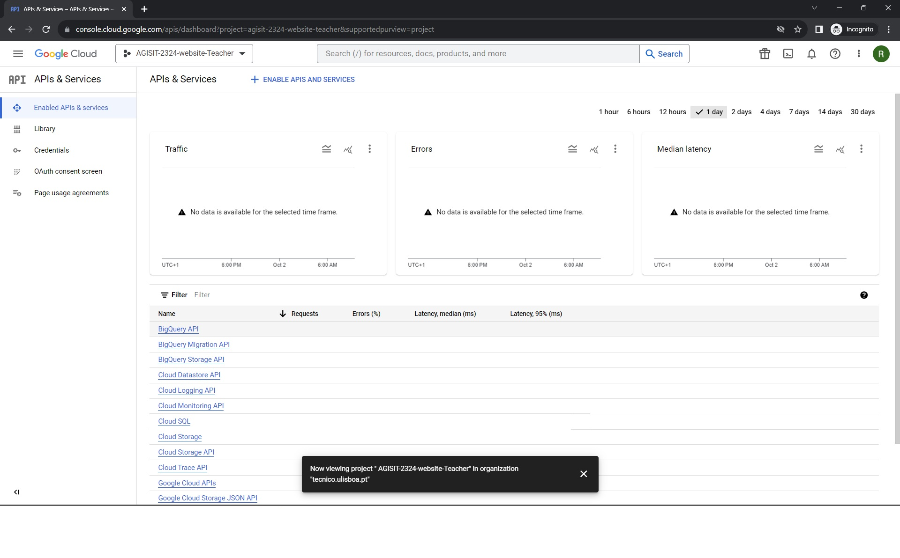

<a href="https://dei.tecnico.ulisboa.pt/"></a>

# [AGISIT 24/25](https://fenix.tecnico.ulisboa.pt/disciplinas/AGI11/2024-2025/1-semestre)

# Lab 3 - Deployment of a cloud-based infrastructure in a Public Cloud (Google Cloud Platform) using automation tools

## Objectives

The end result of this lab experiment will be a fully functioning web infrastructure, composed by several back-end web servers (implemented with NGINX) and one front-end Load Balancer (implemented with haproxy). We will use Terraform to Provision the infrastructure in Google Cloud Platform (GCP), together with the Ansible Configuration Management tool for configuring the compute instances of the infrastructure, install in those instances all of the required applications and packages, deploy the corresponding customized configuration files, and start the respective services. 

In essence, it is the same solution used in previous Lab, but now deployed in a Public Cloud.

<a href="https://dei.tecnico.ulisboa.pt/"></a>

## Google Cloud Platform

Instructions for Registration with an Education Credit Coupon

### Introduction

Public Cloud providers, such as Google Cloud Platform (GCP), charge users per resources used and per time. Therefore, the number of instances created, the uptime of those instances, the network components, packet transmissions, disk/storage used, I/O, and special Services, are some of the items charged by the provider. The cost is proportional to the resource utilization.

The Google Cloud Platform Education Grant for the 2024/2025 Academic year allows students of AGISIT (Management and Administration of IT Infrastructures and Services) course of Instituto Superior Técnico, Universidade de Lisboa, to access and use the Platform “freely” during the academic year.

PLEASE NOTE: This Educational Grant does not correspond to the Free Trial of GCP. Students are not required to register any Credit Card.

### Redeeming the Coupon

To redeem the Coupon, students need to Register in the Platform and <span style="color:red; text-decoration: underline">STRICKTLY</span> observe the following conditions:

1.	Each student of the AGISIT course is assigned (individually) a Coupon with a Face Value of $50.00 USD, without requiring to register any payment method;
2.	To Register in GCP, Students will be asked for a name and email address, as illustrated in the figure, which <span style="text-decoration: underline">MUST be their ``student.name@tecnico.ulisboa.pt`` email, i.e., MUST be signed-in in a browser in the **incognito mode** with their Institutional email account of ``@tecnico.ulisboa.pt``, and <span style="color:red">no other</span>!</span> An email message will be sent to that ``@tecnico.ulisboa.pt`` address to confirm those details before a Coupon is sent;
3.	Each Student can only request ONE code per unique email address; Google keeps track of the addresses that have requested Coupons, and can provide that information to the Teachers;
4.	By the time you are reading this Guide, you should have already received by email, addressed to your ``student.name@tecnico.ulisboa.pt`` account, a message containing a dedicated URL that is necessary to request your Google Cloud Platform Coupon. 


5.	To comply with the previous requirement, grab the provided Coupon Code received in email and then  <span style="text-decoration: underline">**open your browser in incognito mode**</span>, and sign in with the ``student.name@tecnico.ulisboa.pt`` email account in the browser;

<a href="https://dei.tecnico.ulisboa.pt/"></a>

6.	Open the following URL https://console.cloud.google.com/education, and paste the Coupon CODE received, as illustrated in the following figure: 

<a href="https://dei.tecnico.ulisboa.pt/"></a>

7.	After pasting the Coupon code, the page will confirm that it could redeem the Coupon to the Course “Management and Administration of IT”, as illustrated in the following figure, and you just need to Accept and then continue to the Google Cloud Platform Console; If you agree to the terms, click Accept and continue. The credit is added to your GCP Billing account;

<a href="https://dei.tecnico.ulisboa.pt/"></a>

8.	At the end of the specified duration for the Coupon (Expiration Date), any unused credit expires and the student’s course GCP Billing account is shut down automatically. A Coupon credit can be used only for the course it was issued for (although students can use GCP resources for one year, up to the total credit amount, on their own experiments...);
9.	In each account you can create Projects (limited number) and share a Project with other members of the team (i.e., with email address matching the domain ``@tecnico.ulisboa.pt``), if needed.

<span style="color:red">IMPORTANT: Be very careful in these steps, as you may fail to redeem the Coupon if you are not signed-in with the ``@tecnico.ulisboa.pt`` email account. Even if you succeed redeeming the Coupon to your private account, it will not allow you to access the Google Cloud Platform with the resources necessary for the Labs. In such case, THERE IS NO WAY TO CORRECT THE ERROR, nor to request another Coupon.</span>.

### Exploring the GCP Console and Creating a Project

You should take the opportunity to explore the GCP Console, as illustrated in the Figure, and for that, there is the Help Menu, which contains a Tutorial, as well as extensive Documentation covering all aspects and Services available.

Your first task is to create a Project. For that purpose, select on the top Menu Bar the Organization/Projects drop down button, that will open a window for selecting and/or creating a Project, as illustrated in the following figure:

<a href="https://dei.tecnico.ulisboa.pt/"></a>

Select NEW PROJECT and give it a name, following the pattern <span style="color:magenta">AGISIT-2425-website-XXXXX</span>, where <span style="color:magenta">XXXXX</span> is your IST ID or your Group ID (if sharing with your colleagues). This naming convention is to facilitate identification of each project when using the Provisioning Tools.

<a href="https://dei.tecnico.ulisboa.pt/"></a>

The system will then take some time (a minute or more) to create the Project. When complete, you will enter the Project Console (Dashboard).

### The local Git repository for this Lab

In this repository you will find a directory structure similar to the following (simplified):

    
    ├── gcpcloud
       ├── README.md
       ├── ansible-gcp-servers-setup-all.yml
       ├── ansible-load-credentials.sh
       ├── ansible.cfg
       ├── gcphosts
       ├── templates
          ├── haproxy.cfg.j2
          └── index.html.j2
       ├── terraform-gcp-networks.tf
       ├── terraform-gcp-outputs.tf
       ├── terraform-gcp-provider.tf
       ├── terraform-gcp-servers.tf
       └── terraform-gcp-variables.tf

### The Google Cloud SDK

Google Cloud SDK is a set of tools that you can use to manage resources and applications hosted on Google Cloud Platform. These include the gcloud, gsutil, and bq command line tools. A comprehensive guide to the gcloud CLI can be found in https://cloud.google.com/sdk/gcloud/.

The Google Cloud SDK is already installed in the ``mgmt`` node, and so you can use those tools manually for some operations.

To familiarize yourself with the Google Provider in Terraform, you can access the Guide at [Terraform Google Provider](https://registry.terraform.io/providers/hashicorp/google/latest/docs/guides/getting_started).

### Create a Google Cloud fully functional Balanced Web Service

PLEASE NOTE: The following instructions and steps ARE NOT A RECIPE, just a recommended Procedure. Your job is to study the Process to get insight of its purpose, and modify whatever you need in order to ensure that you will arrive to a correctly Provisioned Infrastructure, and a correctly Configured Web Service.

In this repository,  you will find a ``Vagrantfile.(docker/vbox)`` and a ``bootstrap-mgmt(-docker).sh`` that will be used to create and configure the Management Node (``mgmt``) that will be used to manage your infrastructures. We will use Ubuntu OS, named “ubuntu/ focal64”, which corresponds to Ubuntu 20.04 LTS. The ``mgmt`` local node contains the Tools needed for Provisioning and Configuring the Infrastructures.

Start your Management node (``mgmt``) with ``vagrant up``. When ready, access the VM with ``vagrant ssh``.

The ``gcpcloud`` folder is where all the definition files for the GCPCloud infrastructure reside, allowing you to run, in several steps, the tasks that successively deploy the infrastructure and configure the corresponding compute instances with the software that sets up a Load Balanced Web site (in practice, "identical" to the one you have created locally in Lab 2, and also in the Private Cloud of Instituto Superior Técnico (VMCloud) in Lab 3.

### 1. Generating the Google Cloud credentials

Similarly to the process you used in Lab 3 for VMCloud, you need to prepare the Security Keys to access the resources in GCP.

For that purpose, you need to enable APIs and services for your Project, by choosing in the Google Cloud Console ``’API & Services’`` and next selecting ``‘Enabled APIs and Services’``, where you can see a button on the top menu for enabling those services, as illustrated in Figure: 

<a href="https://dei.tecnico.ulisboa.pt/"></a>


Selecting that button opens a new window for selecting the type of API (as in the following Figure). In that window search for **Compute Engine api**, select it and then click ENABLE.

<a href="https://dei.tecnico.ulisboa.pt/"></a>


When the API is enabled (it may take some time...) you can then, in the Google Cloud Console menu, select ``‘IAM and Admin’`` and next ``‘Service Accounts’``. You may then see that a Service Account for the Compute Engine default service account is created.

<a href="https://dei.tecnico.ulisboa.pt/"></a>


There, in Actions, You select ``’Manage keys’``, that opens a new windows to select either ``‘Create new key’`` or ``’Upload existing key’``:

<a href="https://dei.tecnico.ulisboa.pt/"></a>


Select ``’Create new key’``, which opens a pop-up window in which you select the JSON checkbox, as illustrated in the following Figure, which will download to your computer a Credentials file.

<a href="https://dei.tecnico.ulisboa.pt/"></a>


Save the file to the <span style="color:red">gcpcloud</span> folder. <span style="color:red">The Credentials file has your keys to access the GCP service and should be kept safe, and not shared in the git repository.</span>

Please Note: You may need to authorize the Google Cloud SDK (client API), in order to allow controlling the GCP resources from interfaces (APIs) rather than the Dashboard. This API can be invoked in the console of your Management VM (<span style="color:red">mgmt</span>) with the command ``gcloud``, in the project folder <span style="color:red">gcpcloud</span>. The API must be authorized before using it and so, in that <span style="color:red">gcpcloud</span>, you could run the command, as illustrated hereunder, and paste its output (the whole string starting with https://) in a web browser in your host system. You would then be requested to specify your ``@tecnico.ulisboa.pt`` email address in order to ensure that you can be authenticated to the GCP account. Next, as in the following Figure, you should copy the response code, and go back to the <span style="color:red">mgmt</span> console and paste that code in the field Enter verification code:. This authorization is required for tasks such as connecting to the instances via SSH.

    vagrant@mgmt:∼/gcpcloud$ gcloud auth login

    Go to the following link in your browser:

    https://accounts.google.com/o/oauth2/auth?redirect_uri=urn%3Aietf%3 Awg%3Aoauth%3A2.0%3Aoob&prompt=select_acco
    unt&response_type=code& client_id=......www.googleapis.com%2Fauth%2Faccounts.reauth& access_type=offline

    Enter verification code:

<a href="https://dei.tecnico.ulisboa.pt/"></a>


### 2. Provisioning the infrastructure
In this step-by-step approach, you will be able to create the infrastructure in the GCP. Go to the <span style="color:red">gcpcloud</span> folder, and there you have several <span style="color:red">.tf</span> files.

<span style="color:red">Please note: All the project files may contain "dummy" values for some variables, and so you MUST very carefully edit the relevant values, so that they are adequate to the project (even file paths may need to be modified...).</span>

Look into the ``terraform-gcp-variables.tf`` and ``terraform-gcp-provider.tf`` files and replace some of the TAGs with the field values corresponding to your project, as well as the name of the Credentials file from Google (note that you may have already there some dummy value that you need to replace).

Check *https://www.terraform.io/docs/providers/google/index.html* to find more information on how to configure these files.

The ``terraform-gcp-variables.tf`` defines variables that are used by other files. Edit this file and replace <span style="color:magenta">XXXXX</span> with the ID of your project (NOTE: this is not the name you gave to your project in the GCP Console. Select the project name at the top in the Google Cloud Console and retrieve the respective ID), for example:

    variable "GCP_PROJECT_ID" { 
        default = "agisit-2425-website-XXXXX-7657685"
    }

You also should check "machine type", in order to know which would be the "most affordable" for your budget. For that purpose, go to <span style="color:lightblue">*Compute Engine Pricing*</span> and look for N1 standard machine types, selecting the Region, for example Frankfurt (europe-west3), where you want to make the deployment. You should see there, for this project, that a ``n1-standard-1`` type is enough. Do not also forget to look at the Zones in <span style="color:lightblue">*GCP Zones*</span>.

You need to also update the image names for your instances, used in the ``terraform-gcp-servers.tf`` file. For that purpose, go to the ``‘Compute Engine’`` section in the Google Cloud Console menu, and select ``‘Images’``. Search for ``‘ubuntu’``, and copy the name of the Ubuntu (Focal 20.04 LTS) (be careful to choose a x86/64 architecture one) image.

With that step done, you can now initialize Terraform, in order to eventually satisfy some plugin requirements:

    vagrant@mgmt:∼/gcpcloud$ terraform init

As you can observe by studying the files ``terraform-gcp-servers.tf`` and ``terraform-gcp-networks.tf``, your infrastructure code is written (or, to be rigorous, the infrastructure is declared), by defining the desired resources and their characteristics.

You just need to make it live in the Google Cloud. Terraform “talks” to the Google Cloud APIs and makes sure that the planned infrastructure is always up-to-date with what you described in the code of the configuration files.

Before making it live, you are supposed to create a Plan, i.e., a process that compares your assumed **current state**, with the one declared in those configuration files, using API calls that fetch the current state from the Google Cloud Platform. Once you are happy with the Plan output, you Apply it, and if any changes are scheduled, they are actually performed.

Again as with lab2, you can verify that on the Management Node, in the **.ssh** directory (of the home user) there is no public RSA key. Let’s then create one key by running **ssh-keygen -t**, and specify the type of key we want to create, which will be RSA, and then tell how long a key we want with parameter -b. After that, verify that the keys have been created, by listing the contents of **.ssh**.

Please hit **ENTER** to the prompts, and do **not enter a password**.

```
~/tools$ ssh-keygen -t rsa -b 2048
Generating public/private rsa key pair.
Enter file in which to save the key (/home/vagrant/.ssh/id_rsa): 
Enter passphrase (empty for no passphrase): 
Enter same passphrase again: 
Your identification has been saved in /home/vagrant/.ssh/id_rsa
Your public key has been saved in /home/vagrant/.ssh/id_rsa.pub
The key fingerprint is:
SHA256:u9iXXb0ewuCU7u0/5XEfppgX+up9q5/8ZBmXgSMHD3E vagrant@mgmt
The key's randomart image is:
+---[RSA 2048]----+
|           +.E   |
|            = .  |
|           . = . |
|            + . o|
|        S  +   +.|
|         .+ o..+B|
|        .  =++++X|
|       o .+++oo*=|
|      . o..+=**B=|
+----[SHA256]-----+
```

You can now verify that in the **.ssh** directory (of the home user), there is a KEYPAIR of a public and private RSA key.

So, let’s go and create the Plan with the following command, resulting in a long list something similar to:

    vagrant@mgmt:∼/gcpcloud$ terraform plan


To execute the Plan and create the infrastructure, run Apply:

    vagrant@mgmt:∼/gcpcloud$ terraform apply

The output of Terraform can be viewed again with the command ``output``.

Once the command finishes, Terraform will create a new ``terraform.tfstate`` file. This file keeps the current state of the deployed infrastructure, and it is a 1:1 mapping of your deployed infrastructure, meaning that if you change/remove resources form the configuration files, they will be removed from your infrastructure and if you add/change resources to the configuration files, when you run the command Apply those changes will be reflected to the infrastructure.

Note the last lines of the apply command. They print out the public IP addresses of the instances created.

Please note: In case you receive errors similar to the following, then you may just need to select some other [GCP Zone](https://cloud.google.com/compute/docs/regions-zones). Change that in the ``terraform-gcp-variables.tf`` and Plan/Apply again.

    Error: Error waiting for instance to create: 

    The zone 'projects/agisit-2425-XXXXX/zones/europe-west3-c' does not have enough resources available to fulfill the request.  

    Try a different zone, or try again later.

### 3. Configuring GCP Instances with Ansible
Now that the infrastructure is (hopefully) created and deployed in Google Cloud Platform, in order for Ansible to access the machines and configure them, there is the need to populate the INVENTORY file, in this case named ``gcphosts``, present in the same project directory, as well as to edit the ``mgmt`` system ``/etc/hosts`` file with the IP addresses and names of the servers (retrieved from the output of ``‘terraform apply’``).

### 4. Test Communication with remote Instances
In order to ensure that you can reach the remote instances created and provisioned in Google Cloud Platform, you should execute two tests. The first one is just a simple PING using ICMP protocol. The other test is an Ansible ad-hoc “Ping-Pong“ command.

As for the following example, execute those tests to all the instances that you provisioned with Terraform.

    vagrant@mgmt:∼/gcpcloud$ ping balancer

    vagrant@mgmt:∼/gcpcloud$ ansible targets -m ping

    

### 5. Configuring GCP Instances with Ansible
The Ansible **Playbook** for this last step has three **Plays**. The first **Play** contains pre-configuration of the server instances, in order to insert the SSH key for “passwordless”, and to allow remote operation without requiring direct user input.

The second **Play** includes the tasks to install the web server program “NGINX” in all Web nodes and adapt the corresponding configuration files, ensuring in the end that the web service is duly started.

The third **Play** includes the tasks to install the “haproxy” program in the Load Balancer server, as well as the corresponding configuration file, ensuring that the Load Balancer service is duly started.

The Playbook to use for this step is the ``ansible-gcp-servers-setup-all.yml``, which is **almost identical** to the one you have already used in the previous Lab.


HINT 1: The files in which you may need to verify having the adequate "variables" defined or adequate configurations are:

-	The ``haproxy.cfg.j2`` template file
-	The ``index.html.j2`` template file
-	The ``gcphosts`` inventory file
-	The ``ansible.cfg`` configuration file
-	The ``terraform-gcp-variables.tf`` file
-	The ``terraform-gcp-provider.tf`` file
-	The ``terraform-gcp-servers.tf`` file, to change the server instances desired
-	The ``ansible-gcp-servers-setup-all.yml`` Playbook, to adapt for adequate "variables", etc.

So, having done some necessary changes, go ahead and play it:

    vagrant@mgmt:∼/gcpcloud$ ansible-playbook ansible-gcp-servers-setup-all.yml

The tasks in the three **Plays** will take some time, so be patient and wait a few minutes for them to complete. Analyze the returned information (quite large) to see what was performed (or not?).

In case you get errors in some tasks, try to figure out what are the causes, then correct the configuration files corresponding to the failed tasks, and play again the **Playbook**. Repeat the procedure until success.


### 6. Test the Deployed Infrastructure
If everything went smoothly, it means that you have now your Infrastructure created, with the servers running and providing services.

You can now use a web browser in whatever system to observe the Web site, and do the following:

-	Open a web browser, write the URL http://ip-of-the-balancer and hit return. You should be connected to the web site, through the Load Balancer, and one of the web servers should have served your request (the name of the web server and its IP address are shown).
-	Hit the refresh button (hard-refresh: ctrl+f5 in chrome) on the web browser. Did something change? If so, repeat the refresh several times and observe the changes.
-	Open a second browser tab and navigate to the statistics page of the Load Balancer at http://ip-of-the-balancer/haproxy?stats.
-	Going back to the first tab, Hit the refresh button on the web browser several times, and then go to the second tab and verify the changes in the counters.

### 7. Finish the Experiments

To clean the environment (destroy created networks, security groups and instances) run ``terraform destroy``. Make sure the infrastructure has been destroyed by checking with ``terraform refresh`` and checking it manually on the Google Cloud Platform Dashboard.

<div style="border: solid 10px black;">
    <span style="color:red; font-size:30pt;">
        DO NOT FORGET THIS STEP: If you leave resources running, Google will continue to take $$ CASH $$ out of your credit!
    </span>
</div>

When finished with the experiment, Stop the ``mgmt`` Virtual Machine and verify the global state of all active Vagrant environments on the system.

