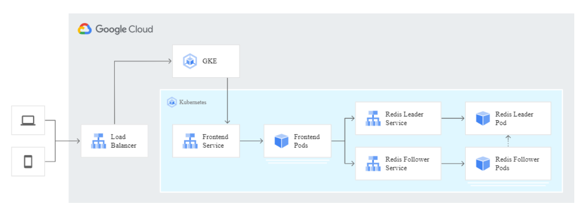
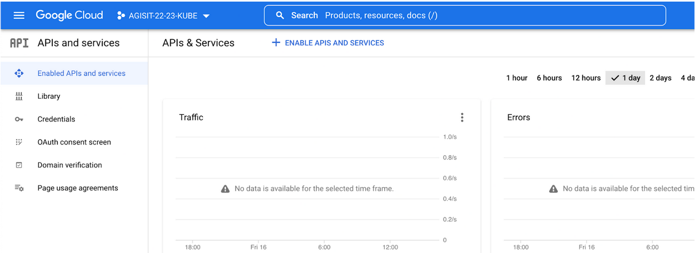
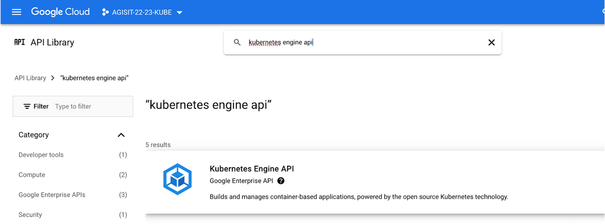
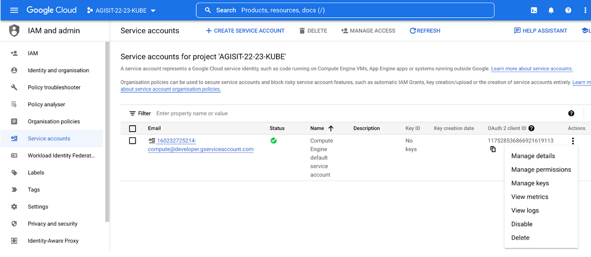
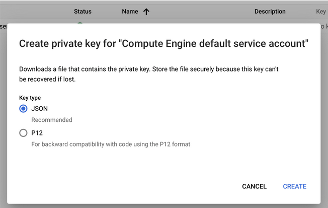
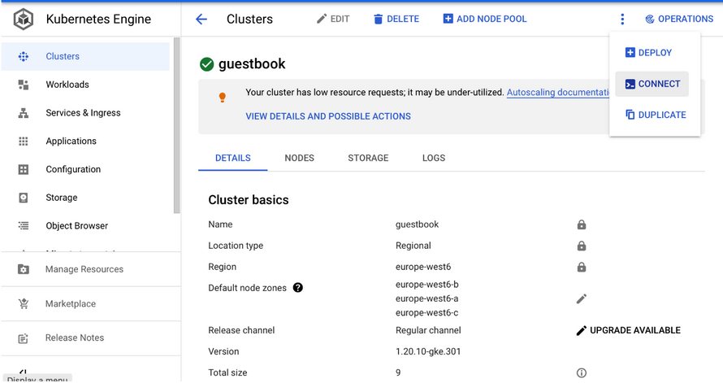
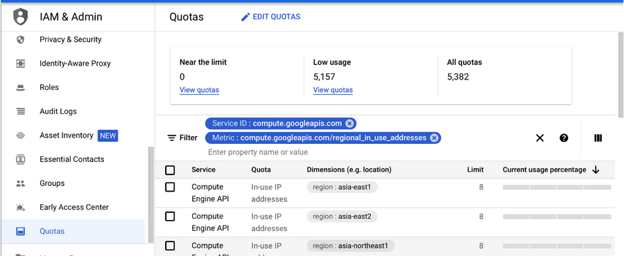
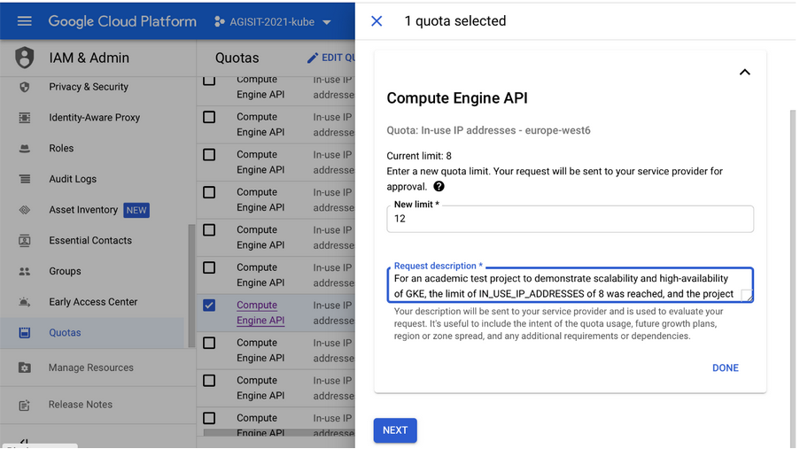
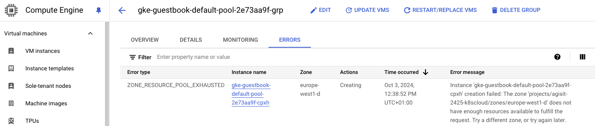

<a href="https://dei.tecnico.ulisboa.pt/"></a>

# [AGISIT 24/25](https://fenix.tecnico.ulisboa.pt/disciplinas/AGI11/2024-2025/1-semestre)

# Lab 5 - Cloud Native on a Cloud-Hosted Kubernetes


## Overview

The objective of this lab experiment is the Deployment of a Cloud-Native (containerized) application in a High-Available and Scalable Cloud-based infrastructure. 


The infrastructure will be provisioned in a **Kubernetes** orchestration platform. We will use for that purpose the **Google Kubernetes Engine** (GKE), a fully managed Kubernetes service for deploying, managing, and scaling containerized applications on Google Cloud.


The separately managed node pool GKE cluster will be provisioned by **Terraform**, which will also be used to deploy the Application in the **Kubernetes** cluster.


## The Guestbook Cloud-Native Application

The application to be deployed is a very simple **GuestBook** [Google Cloud GuestBook](https://cloud.google.com/kubernetes-engine/docs/tutorials/guestbook), a multi-tier web application that lets visitors enter text in a log and see the last few logged entries. The following diagram illustrates the **Kubernetes** cluster architecture to be created.




The Kubernetes Cluster is composed of several nodes deployed **in different Zones of a Region** of Google Cloud Platform, so that it will **Resilient**, **Scalable** and **Highly-Available**.


### The Provisioning and Deployment Modules

The solution is organized in two Modules:
- The first Module corresponds to the **Cluster Specification**, in this case a Kubernetes cluster to be provisioned by **Terraform** on Google Cloud using their **GKE** resource. The specification defines the managed instance group of **Worker** nodes for persistence **Store** and for the Application.
- The second Module corresponds to the **Application Specification**, defining the different **Pods** (using the Replication Controller), and the **Services** that will create the permanent **endpoint** (external address) and the connections to the internal IP addresses of the Pods.


The persistence Store corresponds to the **Backend** of the solution, and is implemented with [REDIS](https://redis.io/), an in-memory data structure store, composed by a **Leader** Pod and several Follower Pods.


The **Frontend** of the solution corresponds to the GuestBook PHP application, implemented in a Debian-based container with an Apache HTTP web server, composed by several replicas that will be Balanced.

## The Google Cloud SDK and Kubernetes Engine (GKE)

Google Cloud SDK is a set of tools that you can use to manage resources and applications hosted on Google Cloud Platform. These include the **gcloud, gsutil, and bq** command line tools. A comprehensive guide to the gcloud CLI can be found [HERE](https://cloud.google.com/sdk/gcloud/).


The Google Cloud SDK is already installed in the **mgmt** node, and so you can use those tools manually for some operations.


The Kubernetes command-line tool, [kubectl](https://kubernetes.io/docs/reference/kubectl/kubectl/), is already installed in the **mgmt** node, and so you can use that tool manually for some operations.

To familiarize yourself with the **Google Provider in Terraform**, you can access the Guide at [Terraform Google Provider](https://registry.terraform.io/providers/hashicorp/google/latest/docs/guides/getting_started).

To familiarize yourself with the **Terraform Kubernetes Provider**, you can access the Guide at [Terraform Kubernetes Provider](https://registry.terraform.io/providers/hashicorp/kubernetes/latest/docs).

For specific interaction of Terraform with **Google Cloud Kubernetes Engine** (GKE), you can access this Guide [Using GKE with Terraform](https://registry.terraform.io/providers/hashicorp/google/latest/docs/guides/using_gke_with_terraform), and also this section about [Google Container Cluster](https://registry.terraform.io/providers/hashicorp/google/latest/docs/resources/container_cluster).


### The Git repository for this Lab

In this Repository, you will find a Directory named k8scloud, which contains the files for this Lab experiment.

```
└── k8scloud
│   ├── gcp-gke-main.tf
│   ├── gcp-gke-provider.tf
│   ├── terraform.tfvars
│   ├── gcp_gke
│   │   └── gcp-gke-cluster.tf
│   └── gcp_k8s
│       ├── k8s-pods.tf
│       ├── k8s-provider.tf
│       ├── k8s-services.tf
│       └── k8s-variables.tf
```

### Deploy a Cloud-Native Application in a Kubernetes Cluster

**PLEASE NOTE**: The following instructions and steps **ARE NOT A RECIPE**, just a recommended Procedure. **Your job is to study the Process** to get insight of its purpose, and modify whatever you will need to modify in order to ensure that you will arrive to a correctly Provisioned Infrastructure, and a correctly Deployed Application.

In this directory, you will find a **Vagrantfile.(docker/vbox)** and a **bootstrap-mgmt(-docker).sh** that will be used to create and configure the **Management Node (mgmt)** that will be used to manage your infrastructures. We will use a Ubuntu OS, named “ubuntu/ focal64”, which corresponds to Ubuntu 20.04 LTS. The mgmt local node contains the Tools needed for Provisioning and Configuring the Infrastructures.

The **k8scloud** folder is where all the definition files reside for accessing the Google Kubernetes Engine (GKE), for provisioning the **Kubernetes Cluster** infrastructure (in subfolder **gcp_gke**), and for deploying the Application containers and Cluster Services (in subfolder **gcp_k8s**).


### 1. Setup the Project and Generate the Google Cloud credentials

Similarly to the process you used for Google Compute Engine (GCE), you need to prepare the Security Keys to access the Kubernetes (GKE) resources.


For that purpose, you need to create a new Project, giving it a name related with Kubernetes.

For that purpose, you need to enable APIs and services for your Project, by choosing in the Google Cloud Console **’API & Services’** and next selecting **‘Enabled APIs and Services’**, where you can see a button on the top menu for enabling those services, as illustrated in Figure: 




Clicking that button opens a new window for selecting the type of API (as in the following figure). In that window, search for **Kubernetes Engine API**, select it and then click **ENABLE**.





When the API is enabled (it may take some time...) you can then, in the Google Cloud Console menu, select **‘IAM and Admin’** and next **‘Service Accounts’**. You may then see that a Service Account for the Compute Engine default.




There, in Actions, You select **’Manage keys’**, that opens a new window to select either **‘Create new key’** or **’Upload existing key’**.

You will select **‘Create new key’**, which opens a pop-up window in which you select the JSON checkbox, as illustrated in the following figure, which will download to your computer a **Credentials file**.




Save the file to the **k8scloud** folder. The Credentials file has your keys to access the Kubernetes GCP service and should be kept safe (not shared in the git repository).


**Please Note**: You may need to authorize the Google Cloud SDK (client API in the Management VM **mgmt**) in order to allow controlling the GCP resources from interfaces (APIs) rather than from the Dashboard. This API can be invoked in the console of your Management VM (**mgmt**) with the command gcloud, in the project folder **k8scloud**. The API must be authorized before using it and so, in that **k8scloud**, you could run the command, as illustrated hereunder, and paste its output (the whole string starting with **https://**) in a web browser in your host system. You would then be requested to specify your **@tecnico.ulisboa.pt** email address in order to ensure that you can be authenticated to the GCP account. Next, as in the following figure, you should copy the response code, and go back to the **mgmt** console and paste that code in the field Enter verification code:. This authorization is required for tasks such as connecting to the instances via SSH.

```
vagrant@mgmt:∼/k8scloud$ gcloud auth login

Go to the following link in your browser:


https://accounts.google.com/o/oauth2/auth?redirect_uri=urn%3Aietf%3Awg%3 Aoauth%3A2.0%3Aoob&prompt=select_acco
unt&response_type=code& client_id=......www.googleapis.com%2Fauth%2Faccounts.reauth& access_type=offline


Enter verification code:
```

You will need also to populate a file in your local Repository (the script called **terraform.tfvars**), with the necessary values of the variables that will be used by Terraform.


***Please Note: this file is not supposed to be pushed to the Repository (in a .gitignore), as it may contain sensitive information, such as credentials. So, it is up to you to modify it locally.***

### 2.Provisioning and Deploying

In this step-by-step approach you will be able to create the infrastructure in the GCP. Go to the k8scloud folder, and there you have several **.tf** files.

***Please note: All the project files may contain "dummy" values for some variables, and so you MUST very carefully edit the relevant values, so that they are adequate to the project (even file paths may need to be modified...).***

Look into the **terraform.tfvars** and **gcp-gke-provider.tf** files and replace some of the TAGs with the field values corresponding to your project, as well as the name of the **Credentials file** downloaded from Google.


Check https://www.terraform.io/docs/providers/google/index.html to find more information about how to configure these files.

The **terraform.tfvars** defines variables that are used by other files and are specifically related to your Project configuration. Edit this file and replace **agisit-2425-XXXXX** with the value you gave for the **ID of your project** (the exact string of your project ID in the GCP Console), the **number of Worker Nodes** for the Kubernetes Cluster and also the **Region**, for example **Northern Virginia (us-east4)**, where it will be provisioned (in multiple Zones of that Region). 

The complete list of regions and zones can be found in [Compute Engine Regions and Zones](https://cloud.google.com/compute/docs/regions-zones/regions-zones).
You can also find your project ID in the Google Cloud Console or retrieve it from the projects list using the Google Cloud SDK:

```shell
vagrant@mgmt:∼/k8scloud$ gcloud projects list
```

***The Project Modules***

You may observe in the project folder that there are two subfolders named **gcp_gke** and **gcp_k8s**. Those folders correspond to the Modules of the project as defined in the **gcp-gke-main.tf** file:

- The **gcp_gke** module contains the definition of the Kubernetes Cluster.
- The **gcp_k8s** module contains the definition of the Pods and the Services.

***The Kubernetes Cluster module***

In the cluster module, you need to obtain the "machine type" for the Worker Nodes of the Kubernetes Cluster, and replace it in the **gcp-gke-cluster.tf** file. For that purpose, go to [Compute Engine Pricing](https://cloud.google.com/compute/all-pricing) and look for **N1 standard machine types**, selecting the **Region**, for example **Northern Virginia (us-east4)**, where you want to make the deployment according to your previous configuration in the **terraform.tfvars** file. You should see there, for this project, that a **n1-standard-2** type is enough.

***The Pods and Services module***

This module contains the definitions for:

- The Provider, in file **k8s-provider.tf**, which, in this case is **kubernetes**.
- The Pods, in file **k8s-pods.tf**, consist of the **Backend** REDIS Leader and Follower Pods, and the **Frontend** web server Pods.
- The Services, in file **k8s-services.tf**, defining the internal networking endpoints of the Pods and also the **Ingress** endpoint (in this case taking the form of a Load Balancer service to the Frontend Pods).

Study all the files in order to understand their purpose and structure.


***Setting the current project in the Google Cloud SDK***

Another action you need to take is to find the project that Google Cloud SDK (client API in the Management VM **mgmt**) is currently pointing to, in order to change it. For that, do the following:

```shell
vagrant@mgmt:∼/k8scloud$ gcloud config get-value project
```

If the returned value does not correspond to this new project, then you need to change it with the command (replacing `<new-project-id>` with the name of this Kubernetes project):

```shell
vagrant@mgmt:∼/k8scloud$ gcloud config set project <new-project-id>
```

***Stating the Provisioning***

You can now initialize **Terraform**, in order to eventually satisfy some plugin requirements:

```shell
vagrant@mgmt:∼/k8scloud$ terraform init
```


If all is satisfied, you just need to make it live in the Google Cloud. **Terraform** “talks” to the Google Cloud APIs and makes sure that the planned infrastructure is always up-to-date with what you described in the code of the configuration files.

Before making it live, you are supposed to create a **Plan**, i.e., a process that compares your assumed current state, with the one declared in those configuration files, using API calls that fetch the current state from the Google Cloud Platform. Once you are happy with the **Plan** output, you **Apply** it, and if any changes are scheduled, they are actually performed.

So, let’s go and create the **Plan** (a dry-run) with the following command (resulting in a long list of all the actions to execute):


```shell
vagrant@mgmt:∼/k8scloud$ terraform plan
```

If there are no errors reported, to execute the **Plan** and create the infrastructure, just run **Apply**:

```shell
vagrant@mgmt:∼/k8scloud$ terraform apply
```

If you encountered any errors or timeouts, refer to the last section [Final Remarks](#final-remarks) in this guide.


Once the command finishes, **Terraform** creates a new **terraform.tfstate** file. This file keeps the current state of the deployed infrastructure, and it is a **1:1 mapping** of your deployed infrastructure, meaning that, if you add/change/remove resources to/from the configuration files, they will be added/changed/removed to/from your infrastructure when you run the command **Apply**. Notice what happens if you try to run `terraform apply` again without modifying the infrastructure.

Observe carefully the **terraform.tfstate** in order to understand what was created. Search also for the **load_balancer ingress** IP address, to use in the next step.


### 3. Test the Deployed Infrastructure

If everything went smoothly, it means that you have now your Infrastructure created, with the Application running and providing services to users.

You can now use a web browser in whatever system to observe the Web Application, as the Infrastructure is available publicly from the Internet, and do the following:


1. Open a web browser, write the URL http://ip-of-the-balancer and hit return (get the "**ip-of-the-balancer**" from the **.tfstate** file). You should be connected to the Guestbook Web Application, a load balanced web service with an external IP, through the Load Balancer.
2. The Guestbook Web Application lets visitors enter text in a log and see the last few logged entries in a database. The Kubernetes cluster is deployed in several Zones (for resiliency) of a Region and High-Availability, with a Load Balanced Web Frontend (several replicas) and Data Store Backend composed by a single "master" Leader and multiple "slave" Followers. Make some entries in the Guestbook (each team member should also do it in the same project), and observe that the data entered are persisted.
3. Open the Kubernetes Engine Clusters in the Google Cloud Console and take note of the Cluster size.
4. You will now use **kubectl** to get information about the cluster. Notice that, if you run **kubectl cluster-info**, it will give you an error. Hence, you will need to go to your cluster in the Google Cloud Console, select the **Connect** button (as in the following figure), and in the pop-up window, copy the command to configure the **kubectl** command line access in the Management VM **mgmt**.
5. Paste that command in the Management VM **mgmt** shell, and verify whether the result confirms that the **kubeconfig entry** was generated in `/home/vagrant/.kube/config`. You can learn more about the command in the [Cloud SDK Documentation](https://cloud.google.com/sdk/gcloud/reference/container/clusters/get-credentials).
6. In the Management VM **mgmt** shell, use the command **kubectl get nodes -o wide** and **kubectl get pods** to get information about their status, and the command **kubectl get service** to get information about the Service elements and addresses. Collect the responses, as they will be necessary later.
7. In the Management VM **mgmt** shell use the following single line command to get information about the locations of the cluster (replacing `<your Region>` with the Region where you have deployed the solution). Take note of the different locations that may appear.

```shell
vagrant@mgmt:∼/k8scloud$ gcloud container clusters describe guestbook --region <your Region> --format='default(locations)'
```

8. In the Google Cloud Console, go to the Kubernetes Engine Clusters and explore the information details of the GuestBook:




### 4. Finish the Experiments


To clean the environment (destroy all resources) run **terraform destroy**. Make sure the infrastructure has been destroyed, by checking with **terraform refresh** and checking it manually on the Google Cloud Platform Dashboard.


***DO NOT FORGET THIS STEP: If you leave resources running, Google will continue to take CASH out of your credit!***


When finished with the experiment, Stop the **mgmt** Virtual Machine and verify the global state of all active Vagrant environments on the system.

### Final Remarks

In case you receive errors similar to the following, then you may just need to select some other GCP Region or change the resources (replicas) and Plan/Apply again. The most common situation for Kubernetes Clusters is related to the IP Addresses in use. If the error is related to other resources such as SSD_TOTAL_GB or CPUS, adjust the following steps accordingly.

```Error: googleapi: Error 403: Insufficient regional quota to satisfy request: resource "IN_USE_ADDRESSES": request requires '9.0' and is short '1.0'. project has a quota of '8.0' with '8.0' available.```

If that is your case, the error message contains a URL that points to the resources Quotas in the several Regions, as illustrated in the following figure, so that you can select the Service mentioned in the error message:



To raise the limit, you can make a Request, as illustrated in the following figure, and typically, Google responds swiftly:



Otherwise, if your `terraform apply` command timed out, it may have been due to **insufficient resources** in the selected region. To confirm this, go to "Google Console -> Kubernetes Engine Service -> Clusters", and select your new cluster. Go to the node pool list and select the default pool, and then go to the instance group list and select any groups without a running status. Go to the Errors tab and check if the error type is `ZONE_RESOURCE_POOL_EXHAUSTED`, similar to the following screenshot. If that's the case, use `terraform destroy` to remove your resources and try deploying again in a **different region**.


